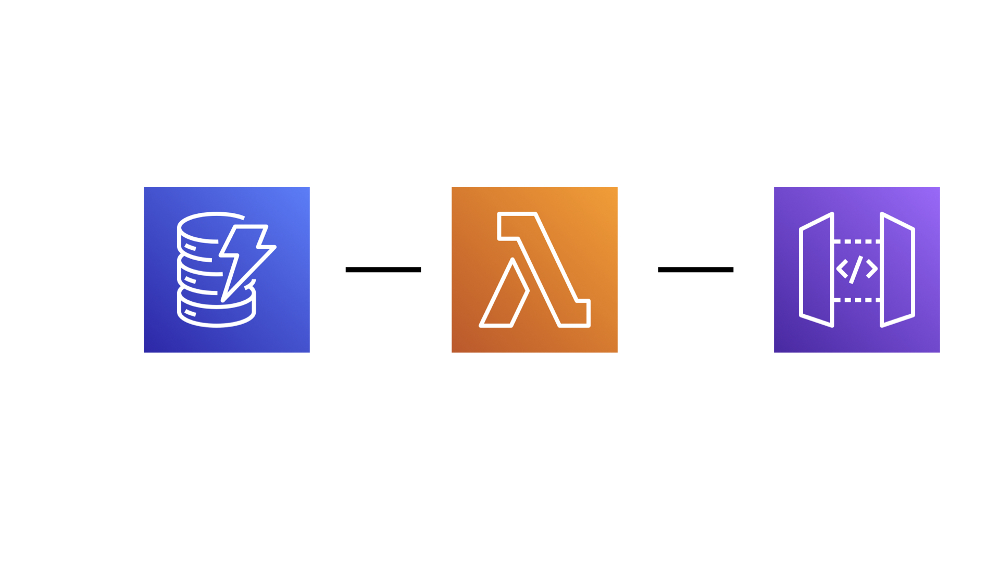

This is a simple serverless application built in Java and the [Micronaut Framework](https://micronaut.io). It consists of an
Websocket [Amazon API Gateway](https://aws.amazon.com/api-gateway/) backed by one [AWS Lambda](https://aws.amazon.com/lambda/)
function and an [Amazon DynamoDB](https://aws.amazon.com/dynamodb/) table for storage.

## Architecture



## Requirements

- [AWS CLI](https://aws.amazon.com/cli/)
- [AWS CDK](https://aws.amazon.com/cdk/)
- Java 11

## How to Deploy 

Use AWS CLI to authenticate.

```
% aws configure
AWS Access Key ID [****************]: 
AWS Secret Access Key [****************]: 
Default region name [us-east-1]:
Default output format [None]:
```

Run the release script

```
% ./release.sh

```

You will get an output
```
...
Outputs:
MicronautApigatewayWebsocketsAppStack.WebSocketUrl = wss://xxxx.execute-api.us-east-1.amazonaws.com/production
Stack ARN:
...
..
```

You can use [wscat](https://github.com/websockets/wscat) to connect 

```
% wscat -c wss://xxx.execute-api.us-east-1.amazonaws.com/production
Connected (press CTRL+C to quit)
> hola
< You said hola
> %
```      